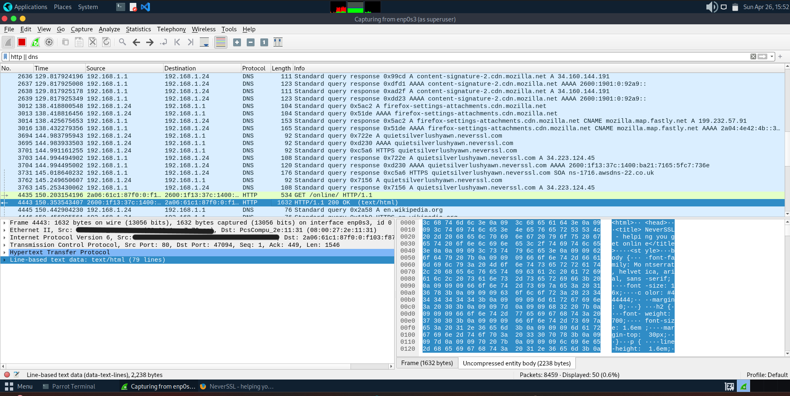
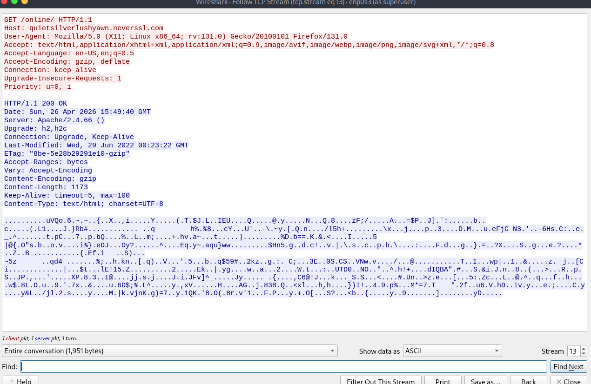
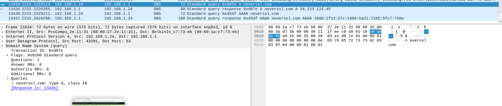
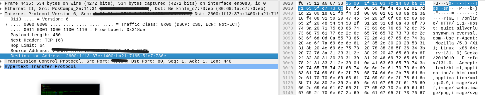
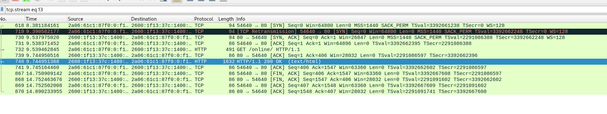
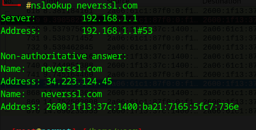

**1. Objective**

With this project, the aim is to capture and analyse the complete process of a web request. by observing a DNS lookup, TCP handshake and finally HTTP get request conversation, to demonstrate an understanding of the OSI model and the encapsulation of data across a network.

**2. Setup**

Operating system: Parrot Security (running via Oracle Box on a Windows 11 machine)  
Tools: Wireshark GUI and terminal CLI  
Network config: bridged adapter with promiscuous mode enabled  
Target: HTTP://neverssl.com (chosen as the site is unencrypted for good, clear-text analysis)  

**3. Process**
* ***Clear cache*** I cleared cache to prevent my browser from disrupting the capture of a clean DNS query. As parrot is debian-based DNS is not cached and i have not installed a daemon for this so just clearing cache within the browser is sufficient.
* ***Wireshark setup*** Within the parrot CLI i ran 'Sudo Wireshark' to start wireshark. Then i selected eth0 from the list of options as this is my primary interface. I applied a filter to the captured of 'HTTP || DNS' ,to wireshark this HTTP or DNS, to remove unwanted traffic from the list.
* ***Generation of target traffic*** using a browser i navigated to HTTP://networkssl.com in order to generate a DNS lookup and HTTP get request. I had to use the 'nslookup' command as my browser hid the DNS lookup from wireshark.
* ***Analysis*** I discovered the DNS query(UDP port 53). Additionally, using the "Follow TCP stream" function I was able to locate the TCP handshake (SYN,SYN-ACK,ACK) and the HTTP get request conversation in clear-text.

**4. Findings**
* ***DNS Resolution*** I successfully captured the standard query for neverssl.com and the response, which linked the domain to the IPv6 address:" 2600:1f13:37c:1400:ba21:7165:5fc7:736e". Due to my Interet Service Provider, IPV4 addresses cannot be monitored using wireshark as all IPV4 requests go through my router and so have a standard IP i.e "192.168.1.1". Thankfully we can circumvent this issue with the use of IPV6 addresses. Using 'Nslookup' in parrot we can query the website and receive the correct IPv4 address.
* ***Transport*** Using wireshark I confirmed that a successful TCP handshake was occuring. I observed the correct incrementation of the sequence and acknowledgement numbers, proving a stable connection was present.
* ***Transparency*** Due to the site utilizing HTTP(port 90) as opposed to the more secure HTTPS(Port 443) I was able to read all the raw data in clear-text including HTTP headers and the servers 200 OK response.

**5. Explanation**

This project is substantial as it mirrors real world network troubleshooting. Understanding the TCP handshake is vital to troubleshooting errors with unstable conections or blockages caused by firewalls.Moreover, seeing the stark contrast between unencrypted and encrypted traffic highlights the absolute importance of TLS/SSL in modern cybersecurity. This project demonstrated understanding of layers 3,4 and 7 of the OSI model, which is a critical foundation of networking.

**6. Screenshots/Evidence**

  

The wireshark traffic list showing the green HTTP packets and blue DNS packets (we are focusing on 3763,4435 and 4443)

  

The "Follow TCP stream" of the HTTP get request where we can see some details about the firmware of the server hosting the website due to the fact HTTP is not encrypted and is clear-text

A screenshot from wirehark showing an enhanced view of a captured DNS query packet. Here we can see DNS using UDP port 53 and the URL of the target website "neverssl.com"

  

The IPv6 address of the target shown here. Due to my ISP IPv4 adresses are not used in the conventional way and are routed straight to my router as generic addresses i.e 192.168.1.1

  

Here we can clearly see the TCP handshake occuring syn, syn-ack and ack. ensuring a stable connection is being made. we can also see FIN,ACK packets showing that the data transfer finished and ended succinctly.

  

in order to ensure the correct packet was being analysed,by double checking the IPv6 address between wireshark and the CLI output, and to force DNS query packets to be detected by wireshark, due to the browser hiding this data from wireshark, nslookup was used on the target URL. here is the terminal output from an non-authoratative DNS server.

